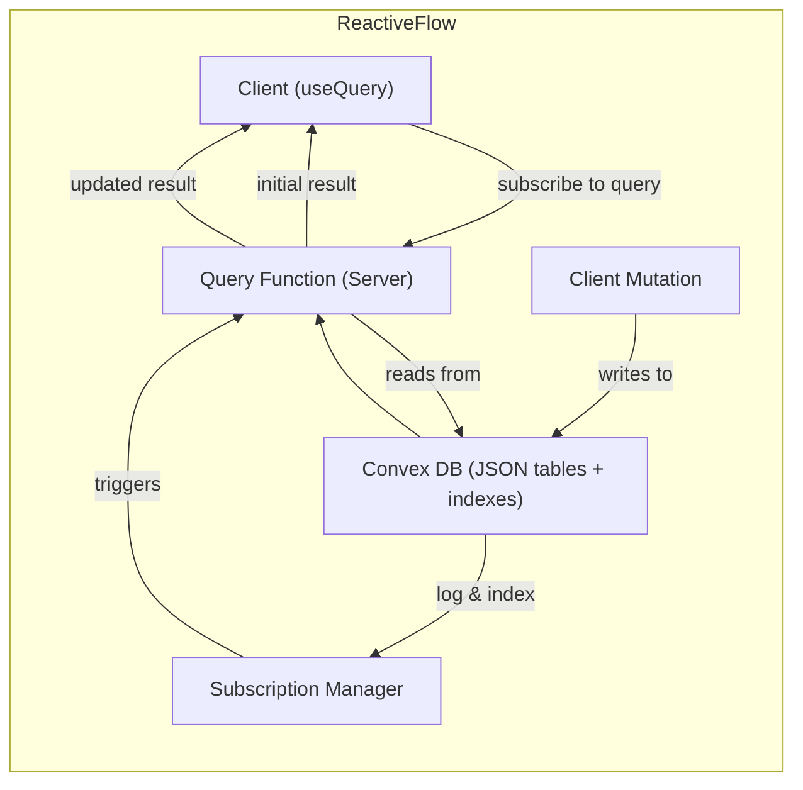

# Convex Query Optimization and Best Practices

**Executive Summary:** Convex is a serverless backend with a custom JSON-document database designed for real-time apps. Queries run as isolated functions that read from indexed tables; results are cached and pushed to clients on data changes【49†L42-L45】【42†L416-L422】. To minimize bandwidth and compute, use indexes and limits to fetch only needed data, paginate large result sets, and avoid scanning. Split “hot” or large fields into separate tables to reduce payloads and invalidations. Cache query results (Convex does this automatically【46†L1670-L1674】), use client-side caching (e.g. React Query) for repeated calls, and batch updates in transactions. Avoid common anti-patterns (full-table scans, unbounded `.collect()`, unnecessary subscriptions)【11†L150-L158】【57†L192-L201】. Monitor usage via Convex logs (each function invocation log includes bytes read/written)【31†L77-L78】. The best practices below—supported by Convex docs and community advice—will keep queries fast and lean (see tables and figures).  

## Convex Architecture & Execution Model

Convex functions (queries, mutations) run in isolated server-side V8 environments with direct access to the database【49†L49-L52】. The DB is a custom JSON-document store built on PostgreSQL (with a write-ahead log on RDS for durability)【49†L54-L58】. Convex uses MVCC/optimistic concurrency: each function sees a consistent snapshot of data at one logical timestamp【42†L418-L421】. When a query runs, Convex **tracks every document it reads**; on a commit that changes any of those docs, it re-runs the query and pushes updates to subscribed clients【49†L42-L45】【57†L289-L297】. Internally, Convex caches results in memory: identical queries (same function + args) hit the cache and do not re-run or read the DB again【46†L1670-L1674】【42†L416-L422】. This means repeated queries on unchanged data incur almost no cost. The commit protocol is fully serializable: overlapping writes that conflict cause one to abort and retry (OCC)【50†L115-L122】. 



This diagram shows the query lifecycle: a client call (via `useQuery` or similar) triggers a Convex query function, which reads indexed documents. The result is sent back, and, if subscribed, kept live by listening for any future writes to those documents. Mutations write to the DB, and the **Subscription Manager** identifies which queries’ read-sets are affected, re-running those queries and streaming the new results to clients. 

## Data Modeling Patterns Affecting Cost

- **Indexes:** Every index accelerates queries but adds write overhead. As Convex docs note, “inserting a document with 16 indexes is comparable to inserting 17 documents”【57†L182-L189】. Use **multi-field indexes** instead of many single-field ones (a 2-field index adds the cost of only *one* index entry). Audit for redundant indexes (e.g. `index("by_a", ["a"])` and `index("by_a_b", ["a","b"])` – the former is usually unnecessary) to reduce write load【37†L308-L311】. 

- **Separate Heavy Fields:** Convex stores entire JSON docs as blobs. Reading a document always reads all fields, even if the query only returns some. Tests show that selecting only one field vs returning the whole document resulted in **identical bytes read**【35†L107-L113】. In practice, store large or frequently changing fields in a separate table. For example, move a big text or image field to another table keyed by the original ID, and only fetch it when needed. This avoids scanning large payloads on every query. (Similarly, to emulate SQL columns, split “toasted” fields manually as recommended in Convex tutorials【35†L107-L113】.) 

- **Hot/Streaming Data:** Fields that update very often (e.g. user presence, live chat text) should be broken out of static docs. If a query reads a document that changes every few seconds, every change will re-run that query and send full data to all subscribers (potentially huge bandwidth)【57†L289-L297】【22†L67-L70】. Instead, isolate volatile state. For example, keep a separate “heartbeat” or “presence” table per user. The query can join (fetch) that table to check status, so only that small record invalidates and reloads. Then the main static user profile can sit unchanged. Indeed, Convex blogs recommend exactly this: “breaking out frequently changing data into separate documents” to limit invalidations【57†L289-L297】. In short, **denormalize** for performance: duplicate or segment data so that minor updates do not ripple through many queries.

- **Aggregate Data Manually:** Convex does not have a built-in `SELECT COUNT(*)` or aggregate on tables, because these operations must scan huge ranges【35†L149-L157】. Instead, maintain counters or use the Aggregate component. For example, increment a “likesCount” field whenever adding a like, so reads don’t require a join/scan【35†L169-L177】. For sums or ranks, consider the official Aggregate utility. These trade simplicity for efficiency. 

## Query Shapes: Single, Range, Joins, Aggregations

- **Single-record fetch:** Use `ctx.db.get(table, id)` or `ctx.db.query(...).unique()` on an index. These are cheap (O(1) or very short range). Avoid querying by non-id if you already have the ID.  

- **Range queries (filters/sorts):** Always **use indexes** for filters. For example:  
  ```js
  // ❌ Full scan: filter without index
  const members = await ctx.db.query("teamMembers")
      .filter(q => q.eq(q.field("team"), teamId)).collect();
  // ✅ Indexed: jump directly to matching team
  const members2 = await ctx.db.query("teamMembers")
      .withIndex("by_team", q => q.eq("team", teamId)).collect();
  ```  
  This change (from [54†L72-L80]) avoids scanning all documents. If you need multiple conditions, create a compound index (e.g. `["team","status"]`). If you do apply a `.filter` after an indexed query, it will still only scan the *range* of matching docs, which is much smaller than a full table scan【54†L72-L80】.

- **Ordering & pagination:** When ordering, use `.order("asc"/"desc")` on an index. To limit results, prefer `.take(n)` or `.paginate(cursorOptions)` rather than collecting all. For example:  
  ```js
  // Inefficient: reads every post (fails at scale)
  const allPosts = await ctx.db.query("posts")
      .order("desc").collect();
  // Better: limit to 50 posts (bounded)
  const somePosts = await ctx.db.query("posts")
      .order("desc").take(50);
  // Best for UI pagination: use cursor paging
  const page = await ctx.db.query("posts")
      .order("desc")
      .paginate({limit: 50, cursor: lastCursor});
  ```  
  As Convex docs show【57†L192-L201】, `.collect()` on a large table can hit service limits (16k docs or 8MiB)【63†L272-L275】. Using `take` or `paginate` bounds the read set. In practice, only load as much data as your UI shows (often 25–100 items)【57†L235-L243】. For infinite scroll or “See more” UI, use `.paginate`. 

- **Joins/relations:** Convex has no single-query join, but you can simulate joins by querying related tables. For example, fetch parent IDs then query child table by those IDs. Libraries like **convex-helpers** (`db.join()`) can simplify one-to-many or many-to-many traversals. In any case, ensure each step is indexed by the key. Complex joins mean multiple queries, so minimize data per step. When planning multi-step reads, factor in the cost of each query and prefer filtering early.

- **Aggregations:** Since there is no `COUNT` or sum primitive, don’t query all rows to compute aggregates. Precompute or maintain totals. (E.g. increment a counter on writes, or use the **Aggregate** component for built-in support【35†L169-L177】.) If you truly must scan, be aware it’s expensive: counting N items requires reading N docs (scanning the index)【35†L149-L157】.

## API Usage Patterns (Projections, Pagination, Streaming)

- **Field selection:** Convex queries always read entire documents from the DB. You can return only selected fields from the query handler (by mapping), but this only reduces the *RPC payload*, not the DB scan【35†L107-L113】. In other words, you pay for reading all fields even if you only return some. To minimize bandwidth, store only needed fields in that table or fetch extra fields on demand. 

- **Pagination/Cursors:** Use `.paginate({limit, cursor})` to page through results. The “cursor” points to a position in the index. A `null` cursor starts at the first element. Paginated queries integrate smoothly with reactivity: Convex handles invalidation across pages【57†L215-L223】. For simple UIs that only need the first page, using `.take(n)` might suffice (fetch top n, e.g. “latest 100 messages”)【57†L235-L243】. 

- **Streaming (real-time) vs polling:** Convex’s query API uses WebSockets by default: clients subscribe via `useQuery()` and get pushed updates. For one-off fetches, you can call queries imperatively (no subscription). Streaming syncs state automatically, but every change in the result set triggers a message. If only one-time data is needed, disable subscription (some libraries offer `{subscribe: false}` or call `client.query()`), to avoid continuous traffic. 

- **Projections vs `map`:** Unlike SQL’s `SELECT`, Convex has no built-in projection at storage layer. If you need to transform data, do it in your query code before returning. E.g. use `.map` in the handler to pick fields. Just remember: this does not reduce DB reads. 

## Caching Strategies

- **Server-side query caching:** Convex **automatically caches query results** as long as inputs (args, auth) don’t change【42†L416-L422】【46†L1670-L1674】. If you call the same query twice in succession with no underlying writes, the second call is served from memory (zero DB reads, near-instant). This greatly reduces compute and bandwidth. Thus, design idempotent, deterministic queries to maximize cache hits. 

- **Client-side caching:** Front-end libraries (React Query, SWR) can cache Convex query results in browser memory. This avoids even the WebSocket round-trip for repeated calls to the same function. When using `useQuery`, the React SDK will reuse stale data until changes arrive. Combine this with Convex’s server cache for multi-user efficiency.

- **HTTP-level caching (CDN):** Convex queries are not standard HTTP GETs; they go over WebSockets or the Convex client. There is no built-in CDN caching for query results. However, if using Convex HTTP actions (custom endpoints), you could set HTTP cache headers manually. In practice for DB queries, rely on the above caches.

## Batching and Bulk Operations

- **Transaction batching:** A Convex mutation function automatically batches all its writes in one atomic transaction. You can safely perform many inserts or updates in a loop. For example, to bulk-insert:  
  ```ts
  export const bulkInsert = mutation({
    args: { items: v.array(/* ... */) },
    handler: async (ctx, { items }) => {
      for (const data of items) {
        await ctx.db.insert("tableName", data);
      }
    },
  });
  ```  
  Convex will queue all inserts and commit them together【64†L247-L255】. This means large bulk upserts are efficient (one I/O and one commit) and atomic. There is no special “bulk” API; just loop. 

- **Large queries or migrations:** If you need to process very large datasets (e.g. migrating millions of rows), break it into chunks. One approach is to use an **Action** or **scheduled function** that loops over segments (by date or ID ranges) with pagination, instead of one huge query. The Convex team advises: “If you’re doing something that requires loading a large number of documents (e.g. a migration), use an action to load them in batches via separate queries/mutations”【37†L300-L304】.

- **Batched reads:** Convex doesn’t have a batch-GET by IDs in a single call, but you can often use `.withIndex(...).collect()` instead of multiple `db.get` calls. For example, rather than looping 100 IDs and doing `get()` each time, store those 100 IDs as an indexable field or do a query with `.filter(q => q.in(…, idList))` if applicable (Convex doesn’t have `in` by default, so the query-all-then-filter pattern can help if the list is small). Always compare one big query vs many small queries to save overhead.

## Real-Time Subscriptions & WebSockets

Subscribing to queries means keeping a persistent WebSocket open. By default, any change to the data your query reads will cause a delta push. **Bandwidth impact:** If your query result is large or if you update docs frequently, this can generate a lot of traffic. For example, a naïve chat app that kept the entire conversation in one document and pushed updates would send the *whole document* on every keystroke – “a lot of data” and exponential growth【22†L67-L70】. The optimized pattern is to stream only new chat chunks (e.g. using an HTTP streaming API or updating a per-message doc) so each update is small【22†L77-L81】. In short, to minimize streaming bandwidth:
- Send *only what changed* (patch a small field, or use a streaming component).
- Batch frequent updates or debounce them, so clients don’t receive every little intermediate state (as in presence-heartbeat, use a 10s interval, not per-frame)【23†L112-L118】.
- Use `.take()` or `.limit` in your subscribed query to cap size, and load “older” items on demand with pagination.

## Security & Auth Implications for Efficiency

- **Access control filtering:** If you apply row-level security by filtering out unauthorized rows at query time, be careful: a filtered query may still scan the full result set then drop rows, causing unnecessary work【26†L691-L694】. For example, if you do `.filter(q => q.eq(q.field("owner"), ctx.auth.userId))` on a table with millions of rows, Convex will still walk the index unless you have an index on `owner`. Always index any auth-based filters. If you “silently” skip unauthorized docs in code instead of the query, you may inadvertently scan extra rows.  

- **Argument validation:** Validating input shapes on public functions can reduce wasted compute on bad queries. Use Convex’s `v.*` validators or a library like Zod to reject invalid inputs early【37†L411-L419】. This isn’t about bandwidth per se, but ensures only legitimate traffic hits your backend. 

- **Least Privilege:** Design your API so queries only ask for needed data. Don’t send more fields than required, to minimize data exposure and payloads. Convex auth tokens can be used (in `ctx.auth`) to enforce that only permissible documents are read. Good practice is to include auth checks in the query/mutation handler so you never read or return extra rows. 

## Monitoring, Profiling & Metrics

Convex provides built-in logging and metrics. In production you can stream logs to observability tools (Axiom, DataDog)【31†L72-L78】. Crucially, each function invocation log includes **data read/written** metrics【31†L77-L78】. By capturing `data.db.readBytes` and `executionTime`, you can track which queries use the most bandwidth or time. Setting up dashboards on these fields lets you identify hotspots. The Convex dashboard itself also shows logs per function (searchable by request ID). 

Additionally, if your queries approach the service limits, Convex will produce warnings. The limits are 16k docs or 8MiB per query【63†L272-L275】; hitting these often indicates you should add an index or limit the query size. 

## Code Examples: Inefficient vs Optimized Queries

- **Filter vs Index:**  
  ```ts
  // ❌ Inefficient: full table scan
  const members = await ctx.db.query("teamMembers")
      .filter(q => q.eq(q.field("team"), teamId)).collect();
  // ✅ Optimized: use index on 'team'
  const members2 = await ctx.db.query("teamMembers")
      .withIndex("by_team", q => q.eq("team", teamId)).collect();
  ```  
  This change (from [54†L72-L80]) makes the query jump directly to the matching range.

- **Pagination vs .collect():**  
  ```ts
  // ❌ Returns all posts – will break if posts are many
  const allPosts = await ctx.db.query("posts").order("desc").collect();
  // ✅ Limits to 100 – safe for large tables
  const recentPosts = await ctx.db.query("posts").order("desc").take(100);
  // ✅ Paginates through posts 50 at a time
  const page = await ctx.db.query("posts").order("desc")
                  .paginate({limit: 50, cursor: lastCursor});
  ```  
  (See [57†L192-L201] for this pattern.) Using `take` or `paginate` bounds the read. 

- **Splitting frequent updates:**  
  ```ts
  // ❌ Stores heartbeat on user doc (every 10s): invalidates all queries reading user table
  await ctx.db.patch("users", userId, { lastSeen: Date.now() });
  // ✅ Better: separate table for heartbeat. Only heartbeat queries re-run.
  await ctx.db.patch("heartbeats", hbId, { lastSeen: Date.now() });
  ```  
  By breaking the volatile `lastSeen` into a smaller `heartbeats` table (and joining it in queries), we only update that table. Queries on user profiles don’t re-fetch the whole profile doc on each heartbeat. This matches the Convex example of data segmentation【57†L274-L282】【57†L289-L297】.

## Best Practices Checklist (Anti-Patterns)

- **Use indexes for filters:**  Never rely on `.filter` without an index (that causes full scans). Always pair `.filter` with a preceding `.withIndex` that covers the field【11†L150-L158】.  
- **Limit `.collect()`:**  Avoid collecting large sets. If you `.collect()`, ensure the result is known to be small or indexed. Otherwise use `.take(n)` or `.paginate()`【57†L239-L244】.  
- **Paginate heavy queries:**  For any list that can grow, use cursor paging. Do not fetch all pages at once. Load just enough to fill the current UI.  
- **Split hot data:**  Don’t update large blobs or shared docs for tiny changes. Use separate tables/components (heartbeat, comments stream, etc.) to isolate high-frequency updates. This prevents over-invalidation and huge payloads【22†L67-L70】【57†L289-L297】.  
- **Batch in mutations:**  Use loops in a single mutation for bulk writes (Convex batches them in one transaction)【64†L247-L255】.  
- **Argument and auth validation:**  Always validate public function inputs (`v.id`, `v.object`, etc.) and check `ctx.auth` early, to avoid unintended heavy queries or data leaks.  
- **Minimal subscriptions:**  Only subscribe when truly needed. For read-only data that rarely changes, a one-off query (no subscription) saves bandwidth.  
- **Monitor limits:**  Watch for “limit” errors (16k docs/8MiB)【63†L272-L275】 and warnings in logs. These indicate queries that must be narrowed or indexed.  
- **Cache taps:**  Design queries so they can cache. Deterministic functions with consistent args benefit from Convex’s automatic caching【42†L416-L422】 (no DB read on repeated calls).  
- **Use aggregates/components:**  For counts/sums, use Convex’s aggregate component or maintain counters. Don’t scan entire tables for totals (Convex prices DB bandwidth by bytes read【35†L107-L113】).

## Trade-offs and When to Use Each Technique

- **Projection vs Simplicity:**  Returning full documents is simplest, but wastes network bandwidth if docs are large. If many fields are unused, splitting into multiple tables can greatly cut query cost【35†L107-L113】.  
- **Query vs Cache:**  A more complex query that uses a cache (with stable inputs) may be faster and cheaper than a trivial re-fetch. For example, keeping frequently-read data in a query and relying on cache is often better than flipping to another table.  
- **Bandwidth vs Compute:**  Pagination/truncating results lowers bandwidth but may require more client logic (e.g. loading “next pages”). Conversely, one big query/collect pushes more data in one go but easier client code.  
- **Mutations vs Queries:**  Mutations should be kept lean too – each mutation’s read-set is limited (same 16k doc rule). Avoid heavy reads in mutations; do counting or aggregation as separate queries.  
- **Real-time vs Polling:**  Real-time updates keep client data fresh but use ongoing bandwidth. If updates are rare, consider polling or manual refresh. Use subscriptions for high-value, frequent-change data (e.g. chat, presence) and plain queries for static data.  
- **Client vs Server Caching:**  Client caching avoids needless query calls (reduces *network* usage) but server caching avoids *DB reads*. Use both: e.g. React Query + Convex auto-cache.

## Comparison of Techniques

| Technique                   | Bandwidth Impact              | Compute Impact               | Complexity                 |
|-----------------------------|-------------------------------|------------------------------|----------------------------|
| Unindexed `.filter`         | **Very High** (full scans)【63†L272-L275】 | **High** (reads many docs)   | Low (easy code)            |
| Indexed query (`withIndex`) | **Low** (range reads)         | **Low**                       | Low                        |
| `.collect()` (all results)  | **Very High**                 | **High**                     | Low                        |
| `.take(n)` (limit)          | **Low** (fixed n)             | **Low**                      | Low                        |
| `.paginate()` (cursor)      | **Moderate** (chunked)        | **Moderate**                 | Medium                     |
| Full Doc Subscription       | **Very High** (each update sends full doc)【22†L67-L70】 | **High** (recompute)         | High (logic to diff data)  |
| Chunked/Streaming updates   | **Low** (only new data)【22†L77-L81】       | **Medium**                   | High (stream protocol)     |
| Batched Mutation (loop)     | N/A                           | **High** (many writes)       | Medium (loop logic)        |

_Note: “Bandwidth” refers to network bytes per operation; “Compute” refers to server work (reads/writes). These are conceptual – real impact depends on data sizes._

## Sources

This guide is based on the official Convex documentation and community resources. Key references include the Convex developer docs on queries, limits, and best practices【42†L416-L422】【63†L272-L275】【11†L150-L158】【37†L300-L302】, as well as Convex blog posts and Q&A describing optimization patterns【54†L72-L80】【57†L192-L201】【22†L67-L70】【26†L691-L694】. These sources provide in-depth examples and rationale for the recommendations above.