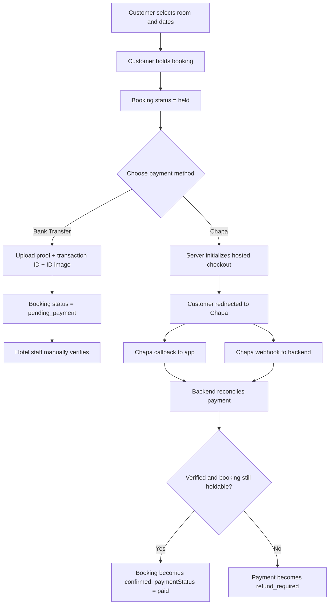

# Chapa Payment Integration Walkthrough

## Why this document exists

This document explains the Chapa integration that was implemented in this repository during this session.

It is written for someone who:

- has not read the Chapa docs yet
- does not know how the payment flow works
- wants to understand both the product flow and the code flow
- wants to know why specific implementation decisions were made

The goal is to make this integration understandable enough that you can:

- explain it to another developer
- debug it later
- extend it safely
- test it with confidence

This write-up is intentionally long and detailed.

## Big picture

Before this work, the app already supported a manual bank-transfer payment flow:

1. Customer creates a booking hold.
2. Customer manually transfers money to a hotel bank account.
3. Customer uploads proof of payment and a national ID image.
4. Hotel staff manually verifies the payment.
5. Staff confirms or rejects the booking.

That flow still exists.

What was added is a second payment path using Chapa hosted checkout:

1. Customer creates a booking hold.
2. Customer chooses `Pay online with Chapa`.
3. The app initializes a Chapa checkout session on the server.
4. The customer is redirected to Chapa.
5. Chapa sends the customer back to the app and also sends a server-to-server webhook.
6. The backend verifies the transaction directly with Chapa.
7. Only after successful server-side verification does the booking become confirmed and paid.

The most important architectural principle is this:

> The booking is never confirmed just because the browser came back with "success".

Instead, the backend must independently verify the transaction with Chapa before trusting it.

## The business problem we were solving

The app had a working booking system and a manual payment proof workflow. But for an online payment provider we needed additional guarantees:

- the customer can pay immediately online
- the app can confirm payment without human review
- duplicate webhook deliveries do not double-confirm bookings
- late payments do not silently confirm an expired hold
- refunds and reversals are visible in the system
- admins can inspect Chapa-specific payment metadata

The design had to preserve the existing bank transfer path while adding a safer automated path beside it.

## High-level architecture

The integration is split across four layers:

1. Data layer in Convex schema
2. Backend payment actions and reconciliation logic
3. HTTP endpoints for webhook and callback handling
4. Frontend booking and admin UI

### Main files

- `convex/schema.ts`
- `convex/chapaInternal.ts`
- `convex/chapaActions.ts`
- `convex/chapaQueries.ts`
- `convex/http.ts`
- `convex/bookings.ts`
- `src/routes/hotels.$hotelId/components/-BookingModal.tsx`
- `src/routes/_authenticated/bookings.tsx`
- `src/routes/admin/bookings/index.tsx`
- `src/routes/admin/bookings/$bookingId.tsx`
- `src/lib/i18n/messages.ts`

## The core product flow

Here is the full intended flow from a user perspective.



## Why the system keeps the booking in `held`

One very important design choice was to keep Chapa bookings in `status = 'held'` until the payment is verified.

We did not move Chapa payments into `pending_payment`.

Why?

Because `pending_payment` already means something very specific in this codebase:

- the customer paid externally
- the customer uploaded proof
- hotel staff still need to verify it manually

That is a manual review state.

For Chapa, we wanted a different model:

- payment is still in progress
- the booking is reserved only temporarily
- the system will auto-confirm if the payment is valid and timely

So the Chapa flow uses:

- booking status stays `held` while checkout is underway
- payment record in `chapaPayments` tracks the checkout lifecycle
- booking becomes `confirmed` only after server-side verification

This keeps the semantics of existing booking statuses clean.

## Why a separate `chapaPayments` table was added

Payments have a lifecycle that is richer than the booking lifecycle.

A booking can be:

- held
- confirmed
- cancelled
- checked in
- checked out

But a payment can be:

- initialized
- paid
- failed
- cancelled
- refund_required
- refund_initiated
- refunded
- reversed

Those are not the same concepts.

So a separate `chapaPayments` table was added in `convex/schema.ts`.

It stores:

- booking linkage
- `txRef`
- Chapa reference
- original booking amount
- charged ETB amount
- fixed FX rate
- provider mode
- payment method
- last event, provider status, and payload
- reconciliation timestamps

## Data model details

### Booking amounts vs charged amounts

The existing app stores booking totals in cents and treats them as USD-like values for pricing display.

Chapa checkout here was implemented in ETB.

So the integration uses a bridge model:

- `booking.totalPrice` remains in the app's existing units
- Chapa charge amount is calculated in ETB
- conversion uses a fixed env var: `CHAPA_FIXED_ETB_PER_USD`

Formula:

```ts
const chargedAmountMinor = Math.round((booking.totalPrice / 100) * fxRate * 100)
```

This means:

1. convert booking cents to whole currency units
2. multiply by the configured ETB rate
3. convert back to ETB minor units

### Why a fixed FX rate was used

This was a deliberate v1 decision.

Benefits:

- no dependency on a live exchange-rate service
- deterministic verification
- easier to audit and debug
- avoids a second third-party dependency for a critical payment path

Tradeoff:

- rates are manual and not real-time

## Environment variables that were configured

The integration depends on several Convex env vars:

```bash
CHAPA_SECRET_KEY
CHAPA_WEBHOOK_SECRET
CHAPA_EXPECTED_MODE
APP_BASE_URL
CHAPA_CALLBACK_BASE_URL
CHAPA_FIXED_ETB_PER_USD
CHAPA_BRAND_NAME
```

### What each one does

#### `CHAPA_SECRET_KEY`

Used by the backend to:

- initialize hosted checkout
- verify transactions against Chapa

#### `CHAPA_WEBHOOK_SECRET`

Used to verify that incoming webhook requests are actually from Chapa.

#### `CHAPA_EXPECTED_MODE`

Expected Chapa environment, usually `test` or `live`.

We compare Chapa's verified response against this to prevent a test/live mismatch.

#### `APP_BASE_URL`

Used to generate the customer-facing return URL after payment.

For local development this was set to:

```bash
http://localhost:3000
```

#### `CHAPA_CALLBACK_BASE_URL`

Used to generate the backend callback URL hosted on Convex:

```bash
https://<deployment>.convex.site/chapa/callback
```

#### `CHAPA_FIXED_ETB_PER_USD`

The fixed conversion rate used to derive the ETB charge amount.

#### `CHAPA_BRAND_NAME`

Used in Chapa checkout customization.

## Why hosted checkout was chosen

Hosted checkout was chosen because it is the safest and fastest v1 path here.

Advantages:

- less PCI-sensitive frontend handling
- simpler implementation
- Chapa owns the payment UI
- easier to reason about in an existing app
- fewer browser-side secrets and integration points

This is why the implementation does not use a Chapa public key on the frontend.

## Backend implementation in plain English

The backend work is split into three main files:

- `convex/chapaInternal.ts`
- `convex/chapaActions.ts`
- `convex/bookings.ts`

### 1. `convex/chapaInternal.ts`

This file is the persistence and state-management layer for Chapa payment records.

It contains:

- validators for the Chapa payment document shape
- a helper that controls safe payment status transitions
- internal functions to create, fetch, and update payment records

### Why this layer exists

I did not want `chapaActions.ts` to directly patch payment documents in multiple places with handwritten objects every time. That would spread state rules around the codebase.

Instead, `chapaInternal.ts` centralizes:

- how payment rows are created
- how they are fetched
- how updates are applied
- which status transitions are allowed

### `shouldApplyStatus`

This helper avoids bad state downgrades.

For example:

- once a payment is `refunded`, it should not later drift back to `paid`
- once a payment is `reversed`, it should not later be overwritten by a weaker state

## `convex/chapaActions.ts`: the real payment brain

This file does three big jobs:

1. initialize hosted checkout
2. verify Chapa transactions
3. reconcile webhook/callback events into final booking/payment state

### Why this file is a Node action

The file begins with:

```ts
'use node'
```

That is needed because:

- we use `crypto`
- we call external HTTP APIs
- we do webhook signature logic

### `initializeHostedCheckout`

This is the public action the frontend calls when the user chooses Chapa.

It does the following:

1. Gets the authenticated identity from Convex auth.
2. Looks up the current user by Clerk user ID.
3. Loads the booking.
4. Ensures the booking exists.
5. Ensures the booking belongs to the current user.
6. Ensures the booking is still in `held`.
7. Ensures the hold is not expired.
8. Reuses the latest initialized checkout if one already exists.
9. Computes the ETB charge amount.
10. Generates a short `tx_ref`.
11. Builds `callback_url` and `return_url`.
12. Calls Chapa's initialize endpoint.
13. If successful, stores a `chapaPayments` record.
14. Returns the hosted checkout URL to the frontend.

### Why we verify ownership here

It is not enough for the frontend to pass a `bookingId`.

The backend must independently ensure:

- the caller is authenticated
- the booking belongs to them

### Why we reuse an existing initialized checkout

If a user clicks the button twice, or refreshes and tries again immediately, we do not want to create unnecessary extra Chapa checkout sessions.

So if the latest payment for that booking is still `initialized`, the server returns the existing `checkoutUrl` and `txRef`.

## The `tx_ref` issue we hit and fixed

During testing, Chapa rejected checkout initialization because the generated `tx_ref` was too long.

That was fixed by generating a shorter reference:

- prefix
- last 8 characters of booking ID
- base36 timestamp
- short random suffix

At the same time, Chapa error extraction was improved so object-shaped validation errors do not cause Convex return-validation failures.

## Server-side verification and reconciliation

Both webhook and callback flow into the same reconciliation logic.

### Why unify webhook and callback?

Because these can arrive in any order:

- webhook first
- callback first
- callback only for a while
- duplicate webhook deliveries

If each path had separate business logic, they could drift and create bugs.

Instead, both call the same reconciliation function.

### What reconciliation does

1. Load expected payment row by `txRef`
2. Load the related booking
3. Handle refund/reversal events directly if applicable
4. Otherwise call Chapa's verify API
5. Compare verified values with expected values:
   - `tx_ref`
   - amount
   - currency
   - provider mode
6. Translate Chapa event/provider statuses into app statuses
7. If verified paid:
   - attempt to confirm the booking
   - if confirmable, mark payment `paid`
   - if not confirmable, mark payment `refund_required`
8. If verified failed/cancelled:
   - mark payment accordingly
   - update booking payment status to `failed`

### Why verify against expected amount/currency/mode?

Because a payment system should not just ask:

> "Did Chapa say success?"

It should ask:

> "Did Chapa say success for the exact payment we expected?"

That is why we compare:

- expected transaction reference
- expected ETB amount
- expected currency
- expected provider mode

If any of those do not match, we do not confirm the booking.

## Why webhook signature verification exists

The webhook endpoint is public on the internet.

That means anyone can try to send fake POST requests to it.

So before processing the webhook payload, the code checks the signature using the configured webhook secret.

Even after signature verification, the code still verifies the transaction with Chapa itself. That means we do not trust the webhook payload alone either.

## Why callback exists if webhook already exists

They serve different roles.

### Webhook

Webhook is for the server. This is the reliable automation signal.

### Callback / return

Callback is tied to the customer browser flow.

It exists so that when the customer returns from Chapa, the system can immediately try to reconcile instead of waiting only for the webhook.

But even callback is not trusted by itself. It still routes into backend verification.

## Why late successful payments become `refund_required`

Imagine this scenario:

1. Customer holds a room.
2. Hold expires.
3. Customer pays successfully anyway a few minutes later.

The chosen design is:

- do not auto-confirm the booking
- mark the payment as `refund_required`

This is honest, operationally safe, and visible to admins.

## Booking confirmation logic in `convex/bookings.ts`

Rather than letting `chapaActions.ts` directly patch bookings however it wants, dedicated internal booking helpers were added.

### `getBookingById`

Internal query used by payment logic.

### `confirmChapaPayment`

This internal mutation atomically converts a booking from:

- `held`

to:

- `confirmed`
- `paymentStatus = 'paid'`

It also:

- stores the Chapa reference in `transactionId`
- clears `holdExpiresAt`
- writes an audit log
- sends the existing booking confirmation notification

It returns explicit outcomes:

- `confirmed`
- `already_confirmed`
- `booking_missing`
- `invalid_state`
- `expired`

### `applyChapaPaymentStatus`

This smaller helper updates the booking payment status when a Chapa payment becomes `failed` or `refunded`.

## HTTP layer in `convex/http.ts`

Two HTTP routes were added:

- `POST /chapa/webhook`
- `GET /chapa/callback`

The HTTP layer stays thin:

- parse incoming request basics
- hand off to business logic
- return the result

## Query layer for customer and admin visibility

`convex/chapaQueries.ts` adds two public queries.

### `getCheckoutStatus(txRef)`

Used by the customer bookings page.

It:

- requires auth
- loads the payment by `txRef`
- loads the associated booking
- ensures the booking belongs to the current user
- returns the current payment status and related booking state

### `getPaymentForBooking(bookingId)`

Used by admin surfaces.

It:

- loads the booking
- requires hotel access for that booking's hotel
- returns the latest Chapa payment record for the booking

## Frontend: what changed in the booking modal

The booking modal was extended to support payment-method choice.

### Before

Step 3 assumed the bank-transfer path.

### After

Step 3 now does this:

1. show booking summary
2. let the user choose:
   - `Pay online with Chapa`
   - `Pay by bank transfer`

### Chapa branch

If the user selects Chapa:

1. the UI shows a short explanation
2. clicking `Proceed to Chapa` calls the Convex action
3. if the action returns a checkout URL, the browser redirects

### Bank branch

The old bank-transfer flow stays intact:

- select hotel bank account
- copy account number
- upload ID image
- enter transaction ID
- submit proof for manual verification

## Frontend: how the customer return state works

When Chapa sends the customer back, the return URL lands on:

```txt
/bookings?payment=processing&tx_ref=...
```

The bookings page was extended to read those search params.

If it sees:

- `payment=processing`
- `tx_ref=<value>`

then it subscribes to `api.chapaQueries.getCheckoutStatus`.
 
### Important note

The original written plan said "poll".

The actual implementation uses a live Convex query subscription instead of manual polling.

Why I changed that:

- simpler code
- fewer timers
- same user outcome
- updates automatically when Convex data changes

## Frontend: admin visibility

Admin booking views were updated in:

- bookings list modal
- full booking detail page

Admins can now see:

- Chapa payment status
- checkout reference
- charged ETB amount
- provider / payment method

## Internationalization work

Because the app uses a central translation file instead of separate locale files, all new copy was added to `src/lib/i18n/messages.ts`.

New strings were added for:

- payment method selection
- Chapa redirect language
- Chapa processing/success/failure states
- refund-required states
- admin Chapa labels

Both English and Amharic sections were updated.

## Why we did not use `?payment=success` as the source of truth

A browser redirect parameter is a weak signal.

It only proves:

- the browser visited a URL

It does not prove:

- the payment really succeeded
- the amount is correct
- the currency is correct
- the booking is still valid
- the payment has not been reversed later

That is why the implementation treats the return URL as a UX hint, not a trust boundary.

The backend is the trust boundary.

## Status design

There are now two overlapping but distinct state machines:

### Booking state machine

- `held`
- `pending_payment`
- `confirmed`
- `checked_in`
- `checked_out`
- `cancelled`
- `expired`
- `outsourced`

### Chapa payment state machine

- `initialized`
- `paid`
- `failed`
- `cancelled`
- `refund_required`
- `refund_initiated`
- `refunded`
- `reversed`

## Security decisions and why they matter

### 1. Auth from JWT, not from client args

The public initialize action reads identity from Convex auth and Clerk JWT, then loads the current user server-side.

### 2. Verify booking ownership

The payment action confirms the booking belongs to the current user.

### 3. Verify webhook signature

This blocks trivial fake webhook attacks.

### 4. Verify directly with Chapa

Do not trust callback/webhook payloads by themselves.

### 5. Compare expected values against verified values

This protects against mismatched amount, currency, mode, or tx reference.

### 6. Do not auto-confirm expired holds

This protects room inventory integrity.

## Why the bank-transfer flow was preserved

Payment integrations are high-risk changes.

If an app already has a working payment-related path, replacing it entirely while adding a new provider is riskier than adding a second clearly separated option.

Keeping the manual flow intact gives you:

- a fallback path if Chapa has issues
- continuity for hotels already using manual verification
- lower regression risk
- easier operational rollout

## What was validated during implementation

After the code changes:

- `npx convex dev --once` passed
- `npm run build` passed

`npm run test` did not provide meaningful automated coverage because the repo currently has no test files.

## How the request path works end to end

### Step 1: customer holds room

Frontend calls `api.bookings.holdRoom`.

Result:

- booking created with `status = 'held'`

### Step 2: customer chooses Chapa

Frontend calls `api.chapaActions.initializeHostedCheckout`.

Backend:

- validates auth, ownership, status, hold validity
- computes ETB amount
- initializes checkout with Chapa
- stores row in `chapaPayments`
- returns `checkoutUrl`

Frontend:

- redirects browser to Chapa hosted checkout

### Step 3: customer pays at Chapa

Chapa does two things:

- redirects the customer back to the app
- sends webhook(s) to Convex

### Step 4 and 5: callback and webhook

Both routes feed the same shared reconciliation flow.

### Step 6: reconciliation

Backend:

- verifies transaction with Chapa API
- compares expected vs verified values
- confirms booking if safe
- otherwise marks refund-required or failure state

### Step 7: customer bookings page updates

Frontend:

- watches the `tx_ref`
- reads payment status via Convex query
- shows banner state accordingly

## Known limitations of the current implementation

This is a strong v1, but it is still a v1.

### 1. Fixed FX rate

There is no live exchange-rate service yet.

### 2. No automated refunds

`refund_required` is recorded, but the app does not yet issue refunds automatically.

### 3. Manual sandbox testing still matters

Build success does not replace real provider testing.

## Recommended next improvements

If you want to evolve this integration further, these are the natural next steps.

### 1. Add automated tests around reconciliation

Especially for:

- success before expiry
- success after expiry
- failed payment
- refunded/reversed webhook
- duplicate webhook deliveries
- verification mismatches

### 2. Add admin refund workflow

This could start as:

- status note
- support action checklist

Later it could become a true provider refund integration.

### 3. Revisit currency strategy

Longer term you may want:

- ETB-native app pricing
- multi-currency display
- live FX with locked quoted amounts

## Why the implementation was done this way overall

If I compress the philosophy of the whole integration into a few points, it would be this:

### 1. Preserve what already works

The manual bank-transfer flow was not broken or replaced.

### 2. Put trust on the server, not the browser

Browser return state is for UX.
Server verification is for truth.

### 3. Model payments as first-class records

Payments are not just booking flags. They have their own lifecycle.

### 4. Share reconciliation logic

Webhook and callback should not disagree with each other.

### 5. Prefer operational safety over optimistic automation

If payment arrives too late, do not guess. Mark `refund_required`.

### 6. Make the system explainable

Payment systems need good metadata, clear states, and admin visibility.

## Short "teach me like I'm new" summary

If you forget everything else, remember this:

1. A booking is held first.
2. The customer either pays by bank transfer or by Chapa.
3. Chapa payments are initialized on the backend, not the frontend.
4. Chapa sends both a callback and a webhook.
5. The backend verifies the payment directly with Chapa.
6. If verified and still valid, the booking becomes confirmed.
7. If the hold expired before payment completed, the system records `refund_required` instead of auto-confirming.
8. Admins can inspect the Chapa payment record later.

## Session outcome summary

During this session, the following was accomplished:

- configured required Convex environment variables for Chapa
- added `chapaPayments` schema support
- added internal payment persistence helpers
- added hosted checkout initialization
- added webhook and callback endpoints
- added shared reconciliation and verification logic
- added booking confirmation helpers for Chapa
- added customer payment-status UI on the bookings page
- added payment-method choice in the booking modal
- added admin visibility for Chapa details
- added translations for the new flow
- fixed the Chapa `tx_ref` length bug discovered during testing
- validated the code with Convex type generation and a production build

No commits were made during the session.

## Final note

The most important thing to understand is that payment integrations are not mainly about showing a checkout button. They are about correctly deciding when money, booking state, and trust all line up.

This implementation was built around that idea.
