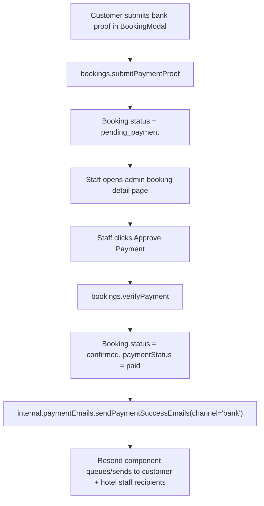
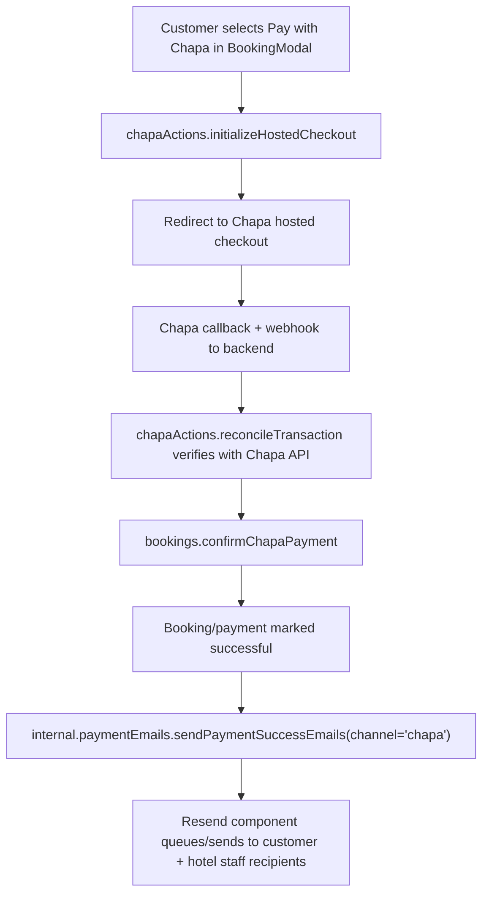

# Web Payment Email System Walkthrough

## Why this document exists

This document explains how the **payment success email system** works for the **web app** in this repository.

It is written for someone who:

- has not implemented Resend in Convex before
- wants to understand exactly when emails are sent
- wants to know how the web payment UX maps to backend email triggers
- needs a reliable reference for debugging delivery issues

The style of this write-up intentionally mirrors the long-form implementation walkthrough style used in this project.

## Scope of this walkthrough

This write-up is intentionally scoped to the **web app payment paths**:

- Chapa hosted checkout from the web booking modal
- Bank-transfer proof flow submitted from the web booking modal and approved from the web admin booking page
- Payment success emails emitted from Convex for those web-driven flows

It does **not** cover mobile UX behavior in detail, even though the backend is shared.

## Big picture

The web app has two payment paths that can result in a successful payment state:

1. Chapa hosted checkout
2. Bank-transfer proof approved by hotel staff

When payment becomes successful through either of those paths, the backend sends transactional emails through the Convex Resend component.

The core rule is:

> Email sending is a backend-side effect of trusted payment state transitions, not a frontend event.

That means the browser never sends emails directly.

## Architecture overview

The web payment email system spans five layers:

1. Web payment UX entry points
2. Booking/payment lifecycle mutations
3. Email orchestration module
4. Resend component integration
5. Resend webhook ingestion

### Main files

- `src/routes/hotels.$hotelId/components/-BookingModal.tsx`
- `src/routes/admin/bookings/$bookingId.tsx`
- `convex/bookings.ts`
- `convex/chapaActions.ts`
- `convex/paymentEmails.ts`
- `convex/convex.config.ts`
- `convex/http.ts`

## Setup model in Convex

Resend is mounted as a Convex component in:

- `convex/convex.config.ts`

```ts
import resend from '@convex-dev/resend/convex.config'
import { defineApp } from 'convex/server'

const app = defineApp()
app.use(resend)
```

This gives the app a typed `components.resend` handle in generated API types, which is then used by the email module.

## The dedicated email module

Email behavior is centralized in:

- `convex/paymentEmails.ts`

This file defines:

- a shared `Resend` client bound to `components.resend`
- one internal mutation: `sendPaymentSuccessEmails`
- recipient normalization and deduplication helpers
- channel labels (`bank`, `chapa`)
- email subject/body generation

### Important design choice: live send mode

The Resend client is configured as:

```ts
export const resend = new Resend(components.resend, {
  testMode: false,
})
```

So this backend is configured for real delivery behavior, subject to sender domain and recipient policy in Resend.

## Web-triggered payment paths and where email is sent

There are two web payment paths that can trigger success emails.

### Path A: Bank proof approved on web admin page

#### Web entry points

1. Customer submits payment proof from booking modal:
   - `api.bookings.submitPaymentProof` from `-BookingModal.tsx`
2. Staff approves from admin booking detail page:
   - `api.bookings.verifyPayment` from `src/routes/admin/bookings/$bookingId.tsx`

#### Backend transition

`verifyPayment` in `convex/bookings.ts`:

- validates staff permissions
- requires booking status `pending_payment`
- patches booking to:
  - `status: 'confirmed'`
  - `paymentStatus: 'paid'`
- creates audit event
- creates in-app booking confirmation notification
- then triggers email send:

```ts
await ctx.runMutation(internal.paymentEmails.sendPaymentSuccessEmails, {
  bookingId: args.bookingId,
  channel: 'bank',
})
```

### Path B: Chapa checkout from web booking modal

#### Web entry points

1. Customer clicks Chapa in booking modal:
   - `api.chapaActions.initializeHostedCheckout`
2. Browser redirects to Chapa hosted checkout
3. Customer returns to `/bookings?payment=processing&tx_ref=...`
4. Bookings page subscribes to `api.chapaQueries.getCheckoutStatus` for status banners

#### Backend transition

Actual payment trust/confirmation happens server-side via Chapa callback/webhook reconciliation:

- `convex/chapaActions.ts` reconciles and verifies payment with provider
- on paid resolution it calls:
  - `internal.bookings.confirmChapaPayment`

Inside `confirmChapaPayment` in `convex/bookings.ts`, email send is triggered when payment becomes paid through Chapa confirmation logic:

```ts
await ctx.runMutation(internal.paymentEmails.sendPaymentSuccessEmails, {
  bookingId: args.bookingId,
  channel: 'chapa',
})
```

This happens in two successful branches:

- `synchronized` branch: booking already `confirmed` but payment was not yet marked paid
- `confirmed` branch: booking was still `held` and now transitions to `confirmed + paid`

No email is sent in non-success returns such as:

- `already_confirmed`
- `invalid_state`
- `expired`
- `booking_missing`

## Trigger matrix (web scope)

| Event source | Backend function | Outcome | Email sent? | Channel tag |
| --- | --- | --- | --- | --- |
| Staff approves bank proof in web admin | `bookings.verifyPayment` | `pending_payment -> confirmed + paid` | Yes | `bank` |
| Chapa paid and synchronized | `bookings.confirmChapaPayment` | `confirmed + paymentStatus paid` | Yes | `chapa` |
| Chapa paid and confirmed from held | `bookings.confirmChapaPayment` | `held -> confirmed + paid` | Yes | `chapa` |
| Cash accepted by staff | `bookings.acceptCashPayment` | payment paid for cash path | No (by design) | n/a |
| Payment rejected | `bookings.rejectPayment` | booking cancelled/failed | No (success-only scope) | n/a |

## End-to-end flow diagrams (web only)

### Bank proof path (web)



### Chapa path (web)



## Recipient resolution logic

Recipient collection is done in `convex/paymentEmails.ts` inside `sendPaymentSuccessEmails`.

Sources:

1. `booking.guestEmail`
2. `customerUser.email` (from `booking.userId` -> `users` table)
3. Every assigned hotel staff user email:
   - `hotelStaff` rows by `booking.hotelId`
   - then `users.email` for each `hotelStaff.userId`

Deduping:

- addresses are trimmed
- lowercased
- empty values removed
- duplicates removed via set-based normalization

So if customer and guest emails are the same value with different casing, only one email is attempted.

## Email content model

Subject format:

- `Payment confirmed for booking #<last6>`

Body includes:

- guest name
- hotel name
- room number
- stay date range
- amount in USD-formatted cents snapshot (`booking.totalPrice / 100`)
- channel label:
  - `Bank payment verification`
  - `Chapa payment`

Both plain text and HTML variants are sent.

## Non-blocking behavior and robustness

Email send attempts are wrapped in `Promise.allSettled`.

Meaning:

- one bad recipient does not crash the whole recipient batch
- booking/payment success mutation does not roll back because of email delivery errors
- failures are not re-thrown from this mutation

Call sites (`verifyPayment` and `confirmChapaPayment`) also wrap email-trigger mutation in `try/catch` and log failures without blocking core booking state updates.

This is intentional: payment state integrity is prioritized over notification side effects.

## Webhook wiring for delivery events

`convex/http.ts` registers:

- `POST /resend-webhook`

and forwards to:

```ts
return await resend.handleResendEventWebhook(ctx, request)
```

This route enables the Resend component to ingest provider delivery events (delivered, bounced, complained, etc.) when configured in the Resend dashboard.

## Environment variables (web deployment)

Required for this system:

- `RESEND_API_KEY`
- `NOTIFICATION_FROM_EMAIL`
- `RESEND_WEBHOOK_SECRET` (when webhook verification is enabled)

Already used by current implementation:

- `NOTIFICATION_FROM_EMAIL` is read directly in `paymentEmails.ts`
- `RESEND_API_KEY` and `RESEND_WEBHOOK_SECRET` are read by the Resend component internals

## Sender domain requirements and the common 422 error

A common failure is:

```json
{
  "name": "validation_error",
  "message": "Invalid `to` field. Please use our testing email address instead of domains like `example.com`.",
  "statusCode": 422
}
```

In practical terms, this usually means your sender/domain/account state is still in restricted mode for real recipients.

For this project, the sender must be a verified address under your domain configuration (for example `noreply@leul.site`) and not left at a default onboarding/testing sender when trying to reach real inboxes.

## Web debugging checklist

When a web payment succeeds but no email arrives:

1. Confirm payment state actually transitioned:
   - bank: `pending_payment -> confirmed + paid`
   - Chapa: confirmation returned `confirmed` or `synchronized`
2. Confirm recipients were resolved:
   - booking guest email present
   - user email present
   - hotel staff users have emails
3. Confirm sender env:
   - `NOTIFICATION_FROM_EMAIL` exists and verified in Resend
4. Confirm component env:
   - `RESEND_API_KEY` set in Convex deployment env
5. Confirm webhook setup:
   - `/resend-webhook` URL configured in Resend dashboard
   - `RESEND_WEBHOOK_SECRET` matches deployment env value
6. Inspect Convex logs for:
   - `Failed to enqueue bank payment success emails`
   - `Failed to enqueue Chapa payment success emails`

## What this system intentionally does not do (web scope)

- It does not send success emails for cash payment acceptance.
- It does not send emails for rejected/failed/refunded events.
- It does not let the web frontend send mail directly.
- It does not block booking confirmation if one recipient email fails.

## Safe extension points

If you want to expand this system later while preserving current behavior:

1. Add new internal mutation(s) in `paymentEmails.ts` for non-success lifecycle notifications.
2. Reuse the existing recipient resolution helper to keep dedupe behavior consistent.
3. Add idempotency guards at call sites if you introduce additional trigger points.
4. Add a persistent email-outbox table in app schema if you need explicit retry/observability beyond component-level tracking.

## Short practical summary

For the web app, payment success emails are sent only when trusted backend payment transitions complete:

- bank proof approval by staff (`verifyPayment`)
- Chapa verified success (`confirmChapaPayment`)

Recipients are computed from booking guest + customer + assigned hotel staff, deduplicated, then sent through Convex Resend component with live mode enabled.

Frontend pages initiate payment actions and show status, but email dispatch is entirely backend-controlled.
